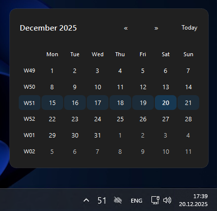
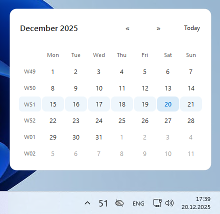
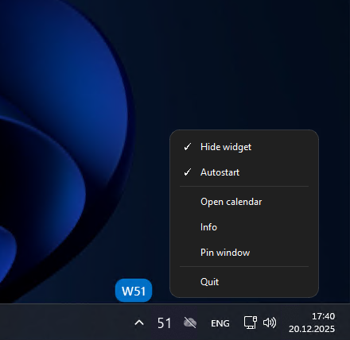
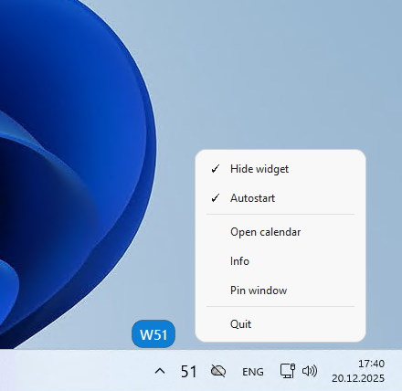
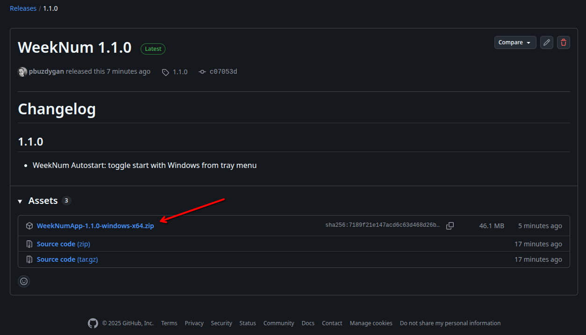
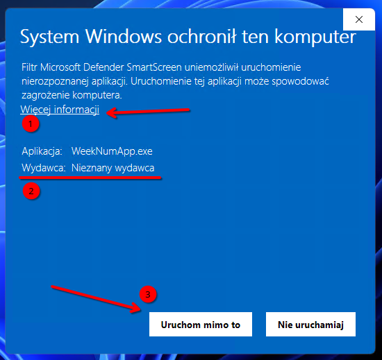

[](https://github.com/pbuzdygan/weeknum/stargazers)
[](https://github.com/pbuzdygan/weeknum/network/members)
[](https://github.com/pbuzdygan/weeknum/issues)
[](https://github.com/pbuzdygan/weeknum/commits/main)
[](LICENSE)

[](https://github.com/pbuzdygan/weeknum/releases/latest)
[](https://github.com/pbuzdygan/weeknum/releases)
[](https://github.com/pbuzdygan/weeknum/releases/latest)

# WeekNum App for Windows

<p align="center">
  
</p>

**WeekNum** App is a lightweight Windows 11 tray application that shows the
current ISO week number and provides a compact calendar with week numbers.
It also includes an optional floating widget on the desktop.


## Features

- tray icon with the week number (digits only)
- tray tooltip with the week number
- tray context menu (right-click)
- Info dialog with banner, clickable links, author and version
- compact calendar shown above the taskbar
- month/year picker inside the same window (no separate dialog)
- Today button
- Pin window option (always on top)
- optional floating widget that can be shown/hidden
- floating, dragable widget
- **WeekNum Autostart** can be enabled/disabled from menu

---
## Demo / Screenshots

### Main UI
<p align="center">
  
  
</p>
<p align="center">
  
  
</p>

## Download ready to launch WeekNum app

WeekNum App has been compiled by GitHub Action Flow (using method described in **Build Exe (Windows)**) and is ready for You to download directly from release Assets:

<p align="center">
  
</p>

Auto generated exe file is not digitally signed and has no publisher (reason is primo: that code sign certificates are expensive and secondo: it is for local/home usage) this is why during first app launch You will see info from Microsoft Defender Smart Screen feature:

<p align="center">
  
</p>

You can simply accept info and run app anyway (Steps 1,2,3)

However if You dont trust compiled exe (which is also fine) You can build it locally on Your own following steps in **Build EXE (Windows)**

And Yes, it is safe to use WeekNum app in corporate/work, unless IT policy is stating different.

## Build EXE (Windows)

The simplest option is PyInstaller.

Install:

```bash
pip install pyinstaller
```
alternatively

```bash
python -m pip install pyinstaller
```

Build:

```bash
pyinstaller --noconsole --onefile --name WeekNumApp --clean --icon icons\WeekNum.ico --add-data "branding\weeknum_banner.png;branding" --add-data "icons\WeekNum.ico;icons" --version-file version_info.txt weeknum_app.py
```

## Run from source

Requirements:
- Python 3.10+ (recommended)
- PySide6

Install dependencies:

for PySide6:

```bash
pip install PySide6
```
alternatively

```bash
python -m pip install PySide6
```
Run:

```bash
python weeknum_app.py
```

## Configuration and data

The app stores settings with QSettings (for example, widget position and
visibility). Data is saved under the user's profile.

## Buy Me a Coffee
If You like results of my efforts, feel free to show that by supporting me.

[](https://www.buymeacoffee.com/pbuzdygan)
<p align="left">
  
</p>
