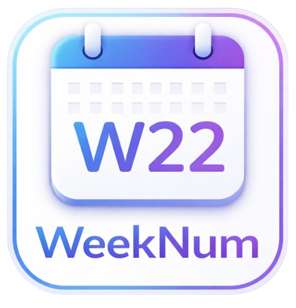
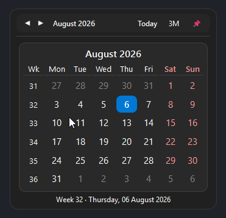
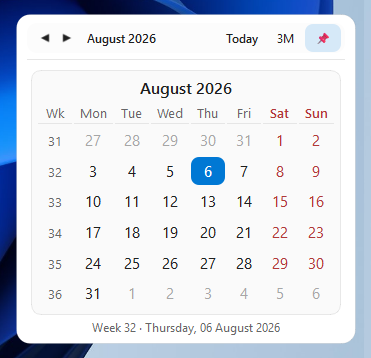
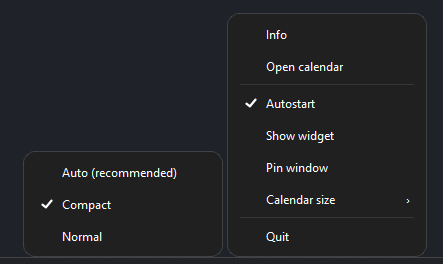
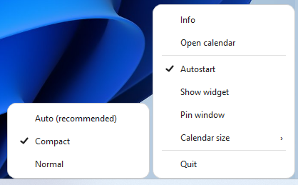
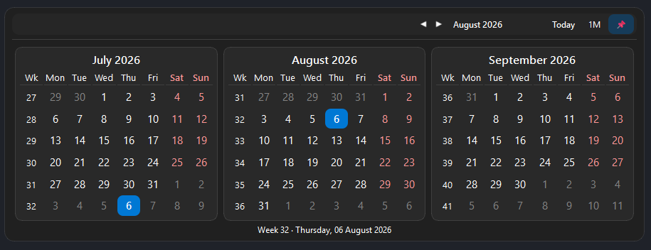
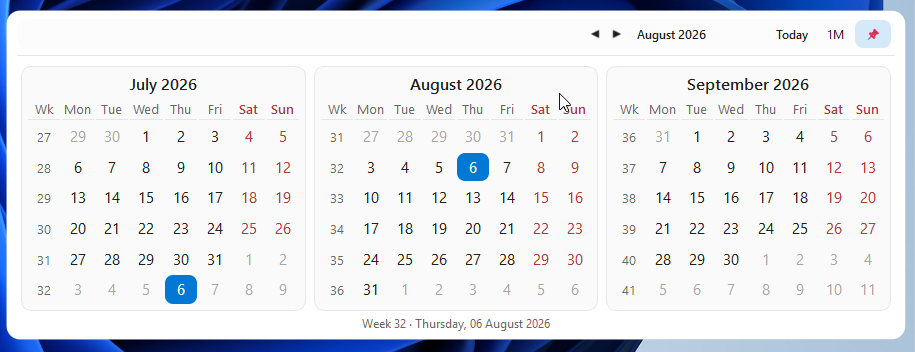
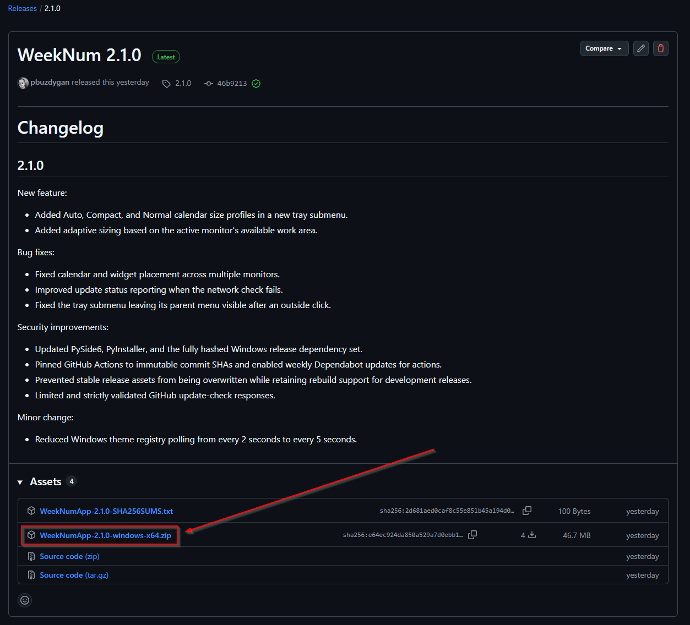
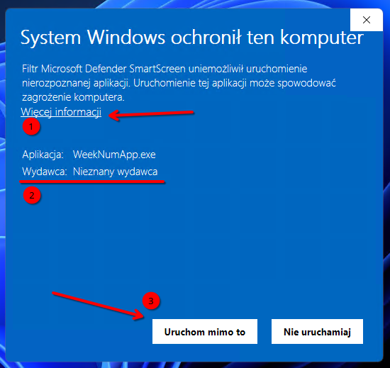

[](https://github.com/pbuzdygan/weeknum/stargazers)
[](https://github.com/pbuzdygan/weeknum/network/members)
[](https://github.com/pbuzdygan/weeknum/issues)
[](https://github.com/pbuzdygan/weeknum/commits/main)
[](LICENSE)

[](https://github.com/pbuzdygan/weeknum/releases/latest)
[](https://github.com/pbuzdygan/weeknum/releases)
[](https://github.com/pbuzdygan/weeknum/releases/latest)

# WeekNum App for Windows

<p align="center">
  
</p>

**WeekNum** App is a lightweight Windows 11 tray application that shows the
current ISO week number and provides a compact calendar with week numbers.
It also includes an optional floating widget on the desktop.


## Features

- tray icon with the week number (digits only)
- tray tooltip with the week number
- compact calendar shown above the taskbar
- month/year picker inside the same window (no separate dialog)
- **Always on top** option
- optional floating and dragable widget that can be shown/hidden
- **WeekNum Autostart** can be enabled/disabled from menu
- **Automatic update check** - WeekNum App will notifiy You that there is a new app release
- **3 months view** - change view between 1 and 3 months
- responsive calendar sizing with **Auto**, **Compact**, and **Normal** profiles

---
## Demo / Screenshots

### Main UI
<p align="center">
  
  
</p>
<p align="center">
  
  
</p>
<p align="center">
  
</p>
<p align="center">
  
</p>

## Download ready to launch WeekNum app

WeekNum App has been compiled by GitHub Action Flow (using method described in **Build Exe (Windows)**) and is ready for You to download directly from release Assets:

<p align="center">
  
</p>

Auto generated exe file is not digitally signed and has no publisher (reason is primo: that code sign certificates are expensive and secondo: it is for local/home usage) this is why during first app launch You will see info from Microsoft Defender Smart Screen feature:

<p align="center">
  
</p>

You can simply accept info and run app anyway (Steps 1,2,3)

However if You dont trust compiled exe (which is also fine) You can build it locally on Your own following steps in **Build EXE (Windows)**

And Yes, it is safe to use WeekNum app in corporate/work, unless IT policy is stating different.

## Security and release integrity

WeekNum release pipeline now adds several security controls around the generated Windows package:

- Windows release builds use a dedicated hash-locked dependency file: `requirements-release-win.txt`
- GitHub Actions runs dependency vulnerability scanning with `pip-audit`
- each release publishes a `SHA256SUMS` file next to the ZIP package
- release artifacts are provenance-attested in GitHub Actions

This does **not** replace code signing, so Microsoft Defender SmartScreen may still show the "unknown publisher" warning. It does, however, improve integrity and traceability of the published release artifacts.

### Verify SHA-256 checksum

After downloading the ZIP and matching `SHA256SUMS` file from the release page, You can verify the package in Windows:

```powershell
Get-FileHash .\WeekNumApp-<tag>-windows-x64.zip -Algorithm SHA256
```

Compare the printed digest with the line stored in the release `SHA256SUMS` file.

### Verify GitHub artifact attestation

If You use GitHub CLI, You can also verify the build provenance attestation for the downloaded release asset:

```bash
gh attestation verify WeekNumApp-<tag>-windows-x64.zip --repo pbuzdygan/weeknum
```

## Build EXE (Windows)

The release workflow uses a dedicated Windows lockfile with pinned versions and SHA-256 hashes. To reproduce the release build locally, install dependencies from the same file:

```bash
python -m pip install --upgrade pip
python -m pip install --only-binary=:all: --require-hashes -r requirements-release-win.txt
```

Build:

```bash
pyinstaller --noconsole --onefile --name WeekNumApp --clean --icon icons\WeekNum.ico --add-data "branding\weeknum_banner.png;branding" --add-data "icons\WeekNum.ico;icons" --version-file version_info.txt weeknum_app.py
```

## Run from source

Requirements:
- Python 3.10+ (recommended)
- PySide6

Install dependencies:

```bash
python -m pip install -r requirements.txt
```

Run:

```bash
python weeknum_app.py
```

## Configuration and data

The app stores settings with QSettings (for example, calendar size, widget
position, and visibility). Data is saved under the user's profile. The default
**Auto** calendar size switches to the Compact profile when the Normal window
would take too much of the current monitor's work area.

## Buy Me a Coffee
If You like results of my efforts, feel free to show that by supporting me.

[](https://www.buymeacoffee.com/pbuzdygan)
<p align="left">
  
</p>
